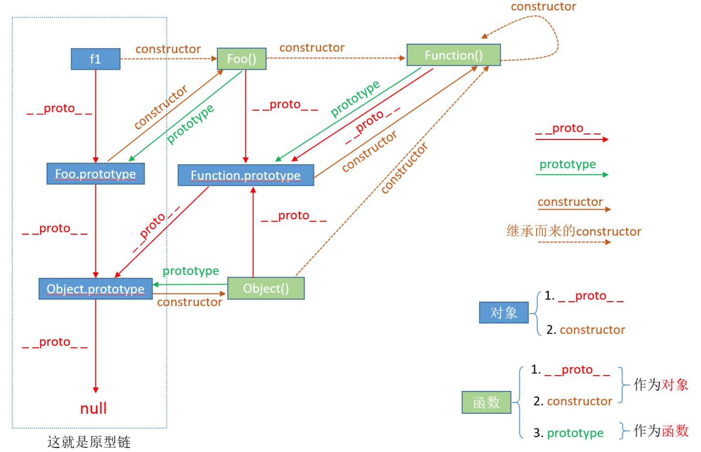

原型链的意义：任何原型都可以通过原型链继承多个对象的property和method。

### **原型链三大规则**

1. 构造函数的prototype指向其原型对象
2. 原型对象的constructor指向构造函数本身
3. 实例对象的__proto__指向构造函数的原型对象

### Important

1. 也就是说构造函数和实例之间并没有直接的联系。和实例之间有直接联系的是构造函数的原型对象。
2. That when we add data to an object, what happens is that data is stored somewhere in memory NOT in the object(syntactically it looks like we are writing on the object). The object only has reference to that data.
3. When you use the delete keyword on an object, you are only deleting the property on the object not where its saved in memory!

### 以下解释都是围绕着下面的例子来讨论

```bash
function Foo() {...};
let f1 = new Foo();
```




### 1. __**proto**__属性

Every object has a __**proto**__  property. __**proto**__ 由一个对象指向另一个对象，也就是说f1.__proto__ 指向一个对象，而且这个对象是他的原型对象，可以理解为创造它的构造函数的原型对象。

这里我们会有一个疑问，为什么Object.Prototype 是最终的原型对象(所有原型对象的祖先)? 因为Object()创造了所有对象，原型链上全是对象，所以原型脸上的对象都是Object()创造的，所以Object()是所有对象的constructor。

### 2. prototype属性

prototype属性指向实例的原型对象，同一个构造函数的实例拥有相同的原型对象，prototype由函数指向对象，含义是函数的原型对象，也就是所创建实例的原型对象。

如关系图所示：Foo.prototype即是f1的原型对象，它本身也是原型链中的对象，可以看做是实例对象。In fact, 任何对象都可以看作是通过Object()构造函数的new操作实例化的对象；之所以这么说，因为所有的对象都直接或间接由new Object()产生。所以，作为实例对象的Foo.prototype，它的构造函数是Object(),原型对象是Foo.prototype。所以实例对象的__proto__属性指向Object.prototype.

### 3. constructor属性

原型对象有一个constructor属性，指向原型对象对应的构造函数。

Foo.prototype.constructor === Foo

实例继承原型对象属性，所以实例对象也有constructor属性，具体过程是这样的：

f1.constructor, f1想查找自身有无constructor属性，肯定没有。所以f1就去它__proto__ 所指向的原型对象找。我们知道f1实例__proto__指向的正式原型对象Foo.prototype, 所以他回去Foo.prototype找，而Foo.prototype里确实有constructor属性。因此，f1.constructor === Foo.prototype.constructor === Foo.

f1 不是直接拥有constructor属性，它是通过继承得到

### 4.Function

函数也是对象，是具有特殊功能的对象。任何函数都可以看作是通过Function()构造函数的new创造的instance。当函数Foo()为实例对象时，它的原型对象是Function.prototype, constructor 是Function. 同样的Object()的原型对象也是Function.prototype, constructor 是Function.

如上所述，所有函数都可以看作是构造函数Function()的new创造的实例。那么Function()自己也不例外。因此，作为实例对象的Function()，它的构造函数是Function()，原型对象是Function.prototype。因为实例的__proto__指向实例的原型对象(创造它的构造函数的原型对象)。作为实例的Function()的构造函数是Function()，那么Function()的原型对象是Function.prototype.所以Function()的__proto__指向Function.prototype.

当Function.prototype作为对象，它的原型是什么？任何对象都可以看作是通过Object()构造函数的new操作实例化的结果。所以Function.prototype的原型对象是Object.prototype。

### 总结

1. 虽然实例对象会继承其原形对象的constructor。但这种情况只发生在本身没有constructor属性的对象上。像Foo.prototype本身有constructor属性。它并不会去继承Object.prototype的constructor属性(指向Object()).
2. 原型对象的意义是它包含了所有实例共享的属性和方法。
3. 所有构造函数的爸爸都是Function()，包括JS中九个原生构造函数，都是Function的实例。
