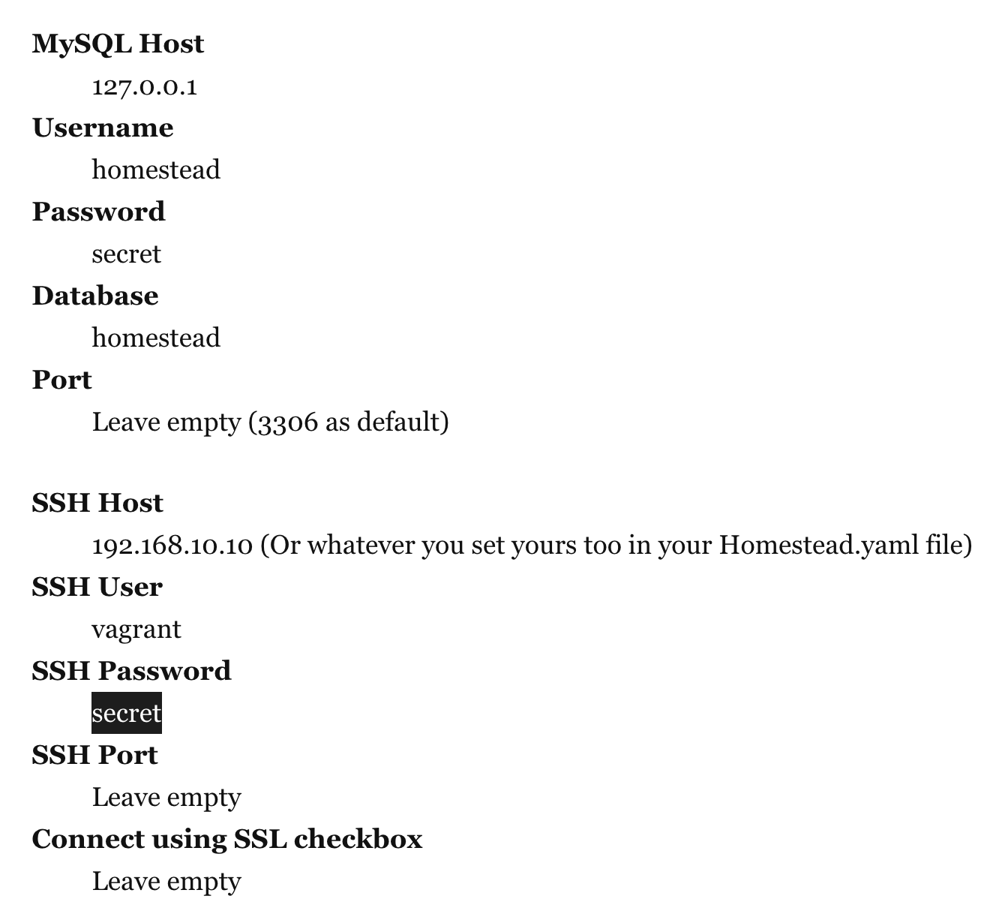

# ISSUE: SQLSTATE[HY000] [1045] Access denied for user 'root'@'localhost' (using password: YES) . DB_HOST set to localhost

### Solution: Connect  to Laravel homestead MySQL database, don't connect other database

Instead of follow the Laravel documentation, I use below info to successfully connect to homestead MySQL database.

I use Sequel Pro as GUI to manage database, here is how I connect Sequel Pro to homestead MySQL database.

**Connect with standard mode**

Host: 192.168.10.10

User: homestead

Password: secret

Port: 3306

Note: Not sure why the host → 127.0.0.1 from the larval doc doesn't work. Also, if you use homestead to serve your application, you must connect to homestead built-in database. Otherwise, I  get error when I try to connect to the MySQL DB that installed on my Mac.
