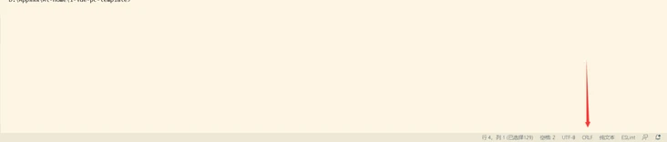

### warning: LF will be replaced by CRLF ... The file will have its original line endings in your working directory.

LF是UNIX/Linux下换行符，CRLF是DOS/Windows下换行符. Git提供了一个“换行符自动转换”功能，这个功能默认处于自动模式。这个转换是双向的。你可以修改Git全局配置来禁用此功能：git config --global core.autocrlf false. 

Dos和Windows平台： 使用回车（CR）和换行（LF）两个字符来结束一行，回车+换行(CR+LF)，即“\r\n”；Mac 和 Linux平台：只使用换行（LF）一个字符来结束一行，即“\n”；最早Mac每行结尾是回车CR 即'\r'，后mac os x 也投奔了 unix。

In VS code, you can also 手动设置换行符格式



在windows中安装git时，默认autocrlf = ture. If core.autocrlf is set to true, that means that any time you add a file to the git repo that git thinks is a text file, it will turn all CRLF line endings to just LF before it stores it in the commit. Whenever you git checkout something, all text files automatically will have their LF line endings converted to CRLF endings. This allows development of a project across platforms that use different line-ending styles without commits being very noisy because each editor changes the line ending style as the line ending style is always consistently LF.

The side-effect of this convenient conversion, and this is what the warning you're seeing is about, is that if a text file you authored originally had LF endings instead of CRLF, it will be stored with LF as usual, but when checked out later it will have CRLF endings.

So basically, based on the accepted answer, the message "LF will be replaced by CRLF" means "Next time this file will be checkout, LF will be replaced by CRLF". It does not mean Git will replace LF with CRLF and stores it in the commit.

**When does this warning show up (under Windows)**

`autocrlf` = `true` if you have unix-style `lf` in one of your files (= RARELY),    – `autocrlf` = `input` if you have win-style `crlf` in one of your files (= almost ALWAYS),    – `autocrlf` = `false` – NEVER!

**What does this warning mean**

The warning "*LF will be replaced by CRLF*" says that you (having `autocrlf`=`true`) will lose your unix-style LF after **commit-checkout cycle** (it will be replaced by windows-style CRLF). Git doesn't expect you to use unix-style LF under windows.

The warning "*CRLF will be replaced by LF*" says that you (having `autocrlf`=`input`) will lose your windows-style CRLF after a commit-checkout cycle (it will be replaced by unix-style LF). Don't use `input` under windows.

通常情况下，Git库不会自动修改文件内容，但是默认会将入库的文件的行尾符设置为LF，会将检出的文件的行尾符设置为CRLF。但是在执行如下操作时出现如下警告：

```bash
C:\Sam\works\bba-master>git add mywebdav.conf
warning: LF will be replaced by CRLF in mywebdav.conf.
The file will have its original line endings in your working directory.
```

说明：工作目录中的mywebdav.conf文件的行尾是LF，但是这里在即将入Git库之前，却将LF转换为CRLF。所以给出警告。该警告无伤大雅，因为在Git库中的该文件仍然以LF为行尾。

在Git中，可以通过设置core.autocrl来显示当前你的Git中采取哪种对待换行符的方式

```bash
git config core.autocrlf #此命令会有三个输出，“true”，“false”或者“input”

#为true时，Git会将你add的所有文件视为文本文件，将结尾的CRLF转换为LF，而checkout时会再将文件的LF格式转为CRLF格式。

#为false时，line endings不做任何改变，文本文件保持其原来的样子。

#为input时，add时Git会把CRLF转换为LF，而check时仍旧为LF，所以Windows操作系统不建议设置此值。
```

```bash
#查看core.autocrlf属性, 默认core.autocrlf属性设置如下。

git config --global --get core.autocrlf

git config --get core.autocrlf
true
```

I**mportant**

1. Git 的 Windows 客户端基本都会默认设置 core.autocrlf=true，设置core.autocrlf=true, 只要保持工作区都是纯 CRLF 文件，编辑器用 CRLF 换行，就不会出现警告了；
2. Linux 最好不要设置 core.autocrlf，因为这个配置算是为 Windows 平台定制；
3. Windows 上设置 core.autocrlf=false，仓库里也没有配置 .gitattributes，很容易引入 CRLF 或者混合换行符（Mixed Line Endings，一个文件里既有 LF 又有CRLF）到版本库，这样就可能产生各种奇怪的问题。

**解决办法：**

1. git 的 Windows 客户端基本都会默认设置 core.autocrlf=true，设置core.autocrlf=true, 只要保持工作区都是纯 CRLF 文件，编辑器用 CRLF 换行，就不会出现警告了；
2. Another option is set the proper line endings in the .gitattributes file. This is committed to the repository in the root and it will overrides autocrlf settings.
    
    ```bash
    # Set all files to have LF line endings
    * text eol=lf
    ```
    
3. 对于web来说，虽然开发环境是windows ， 将来还是会部署到 linux 上， 不禁用会好些。但如果你觉得总是看到此警告比较烦的话，**可以在平常所用IDE中设置下换行符为LF**，以保持与Linux系统下的统一
4. Also, you can set core.eol to lf, use the eol attribute for a single file and the core.eol configuration variable for all text files. Note that setting core.autocrlf to true or input overrides core.eol. So you need to turn off autocrlf first before you do this.
5. 将core.autocrlf设为false即可解决这个问题，如果你和你的伙伴只工作于Windows平台或者Linux平台，那么没问题，不过如果是存在跨平台的现象的话，还是需要考虑一下。
    
    Leave autocrlf = ture on windows, and make sure don't mix bring lf file into windows (don't copy project from your Mac, instead clone it from github). 并且确保没有混合换行符。
    
    ```bash
    git config --global core.autocrlf true #提交时转换为LF，检出时转换为CRLF
    git config --global core.safecrlf true #拒绝提交包含混合换行符的文件
    ```
    

**Best Solution**

[https://stackoverflow.com/questions/2517190/how-do-i-force-git-to-use-lf-instead-of-crlf-under-windows/13154031#13154031](https://stackoverflow.com/questions/2517190/how-do-i-force-git-to-use-lf-instead-of-crlf-under-windows/13154031#13154031)

**My current solution: use LF for all projects**

My personal preference is configuring the editor/IDE to use Unix-style endings, and setting core.autocrlf to false.
