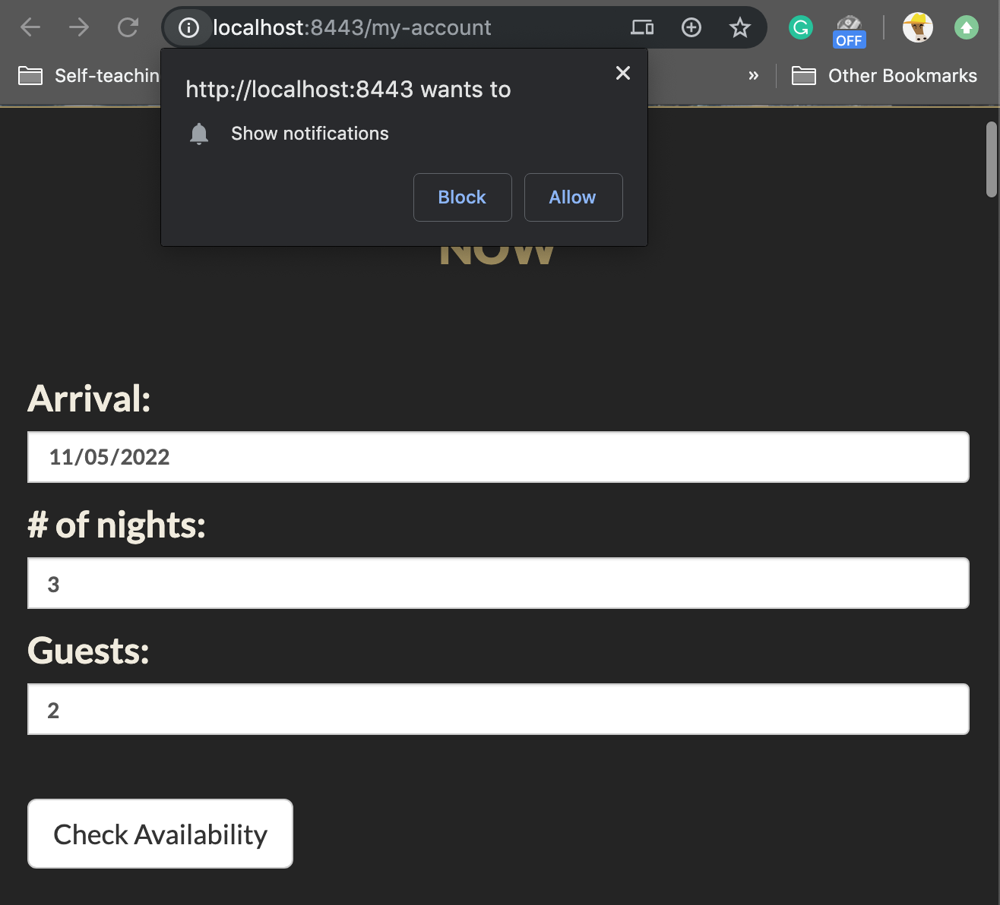
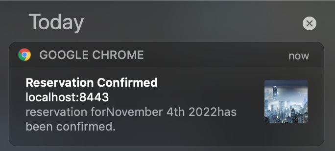
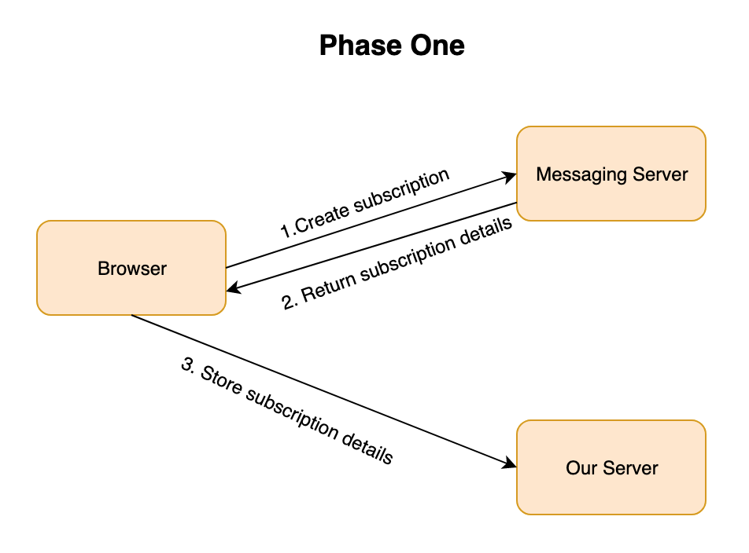
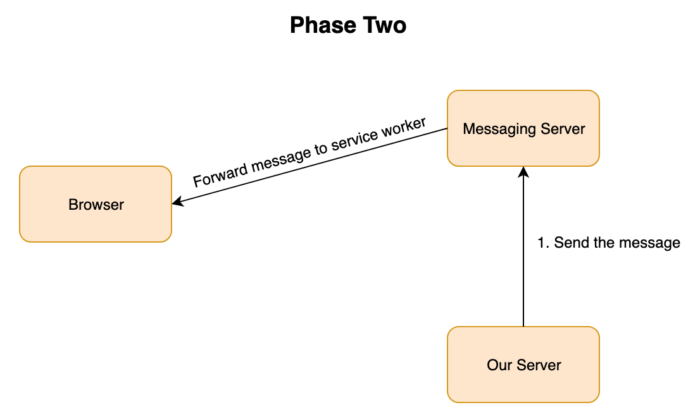
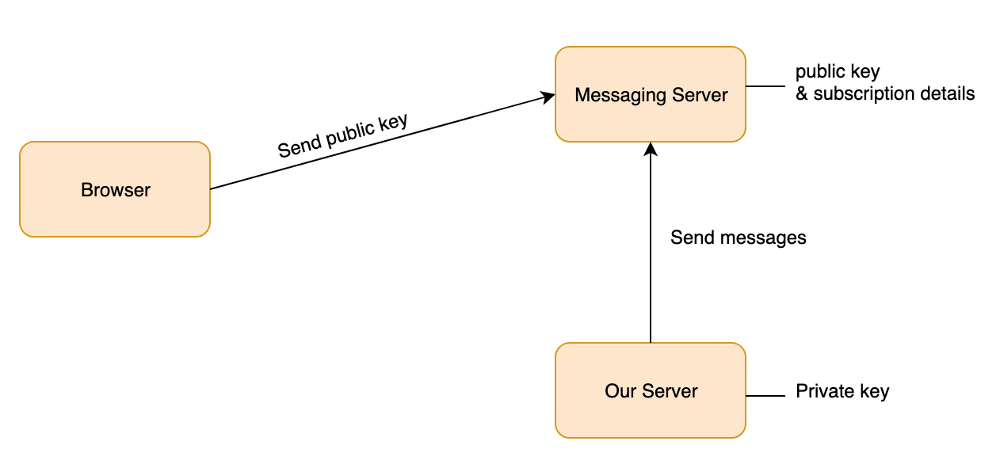

# Push notification cannot show in "Building Progressive Web Apps" by Tal Ater

## The Problem
This document is an exploration of a problem I've met when following the "Building Progressive Web Apps" by Tal Ater. The problem is I cannot make the push notification to work on the app. According to the chapter 10 in the book, it supposes to ask user for permission after user clicks the making reservation button . If user grants the permission, the website will send a notification which contain the reservation details.(Figure 1)
<br/>
<br/>




<br clear="both"/>
<br />

*Firgue 1 The behavior of the ideal push notification*

## The Reason
After investigation, I found the reason is the subscription object generated by the server when user create a reservation. These reservatons contains a public key. This key will be matched with the private key store in our server. When I granted the permission last time, the server will store my subscription in the database. My subscriptions' public key might be outdated. So it cannot match with the private key. As a result, the notification cannot be pushed to user. Below is my investigation.

## The Investigation 

### The Process of Push Notification
Before even talking about my process of investigation, I want to first go through the procedure of push notifications.(BTW, we use push API in this book to create notifications). First of all, this process indluce two phases. In the first phase, our web page will use push API to create subscriptions and send it to the center messaging server which stores the details of the new subscription and returns it to our page. Then, our page will send the subscription details to our server where they can be stored for future use. In our app, the server's database will store this infomation. Time passes, it time to start the second phase which will send the notification messages from our server to the browser. When it's time to send the message, our server will utilize the details it sotered previouly and send them to the messaging sever. The message server will forward the message to the browser. Finally, our service worker will receives the message and decides what to do with it. (Figure 2)
<br/>
<br/>




<br clear="both"/>
<br />

*Firgue 2 The Process sending push notification*

### The Encryption
Before we can dicuss inspect the code, there is another imporant component of the subscriptions, the encryption. When subscribing user to push message, the subscription destails returned by the messaging server contains important information allow any malicious entitiy to send unlimited messages. To make sure only our server is allowed to send messages, the messaging server only accpets message signed with a private key stored on out server. Each private key has a corresponding public key. This public key is send long with scripts to the messaging server when create new subscriptions. It is then stored in the messaging server. This key is only used to verify the message sent from our server to message server are signed with correct private key. (Figure 3)


*Firgue 3 The Process sending push notification*

### Subscribing User to Push Messages 

After review the process of sending push notification and encryption, let's focus on the code we wrote to make that happen. First, we added following code to create a new subscription and store the details on our server. 

```javascript
var subscribeUserToNotifications = function() {
  Notification.requestPermission().then(function(permission){
    if (permission === "granted") {
      var subscribeOptions = {
        userVisibleOnly: true,
        applicationServerKey: urlBase64ToUnit8Array("BIF-3qSLfdr_cXp7cbY5LS83mCs4vA4mhKStWZw8nDfbuy3EYdZvwMEaE0_5FDd33b80GwywuicCz54K0sqhwtU")
      };
      navigator.serviceWorker.ready.then(function(registration){
        return registration.pushManager.subscribe(subscribeOptions);
      }).then(function(subscription){
        var fetchOptions = {
          method: "post",
          headers: new Headers({
            "Content-Type": "application/json"
          }),
          body: JSON.stringify(subscription)
        };
        return fetch("/add-subscription", fetchOptions);
      }).catch(function(){
        console.log("encode failed");
      });
    }
  });
};

var offerNotification = function () {
  if ("Notification" in window && 
      "serviceWorker" in navigator && "PushManager" in window) {
        Notification.requestPermission().then(function(permission){
          if (permission === "granted") {
            subscribeUserToNotifications();
          }
        });
      }
};
```
