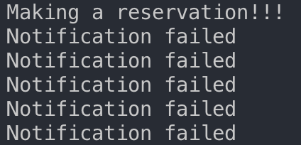
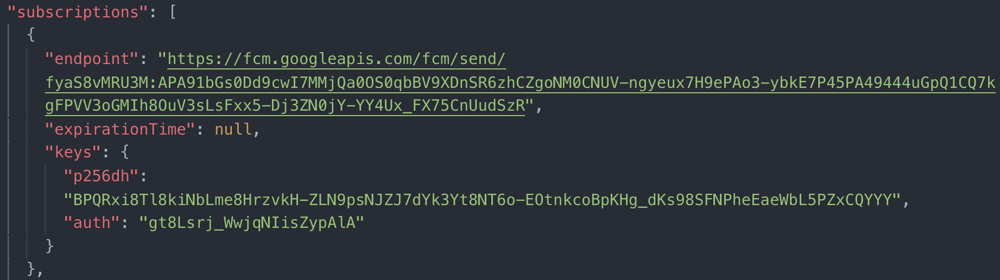

# Push notification cannot show in "Building Progressive Web Apps" by Tal Ater

## The Problem
This document is an exploration of a problem I've met when following the "Building Progressive Web Apps" by Tal Ater. The problem is I cannot make the push notification to work on the app. According to the chapter 10 in the book, it supposes to ask user for permission after user clicks the making reservation button . If user grants the permission, the website will send a notification which contain the reservation details.(Figure 1)
<br/>
<br/>


<br clear="both"/>
<br />

*Firgue 1 The behavior of the ideal push notification*

## The Reason
After investigation, I found the reason is the subscription object generated by the server when user create a reservation. These reservatons contains a public key. This key will be matched with the private key store in our server. When I granted the permission last time, the server will store my subscription in the database. My subscriptions' public key might be outdated. So it cannot match with the private key. As a result, the notification cannot be pushed to user. Below is my investigation.

## The Investigation 

### The Process of Push Notification
Before even talking about my process of investigation, I want to first go through the procedure of push notifications.(BTW, we use push API in this book to create notifications). First of all, this process indluce two phases. In the first phase, our web page will use push API to create subscriptions and send it to the center messaging server which stores the details of the new subscription and returns it to our page. Then, our page will send the subscription details to our server where they can be stored for future use. In our app, the server's database will store this infomation. Time passes, it time to start the second phase which will send the notification messages from our server to the browser. When it's time to send the message, our server will utilize the details it sotered previouly and send them to the messaging sever. The message server will forward the message to the browser. Finally, our service worker will receives the message and decides what to do with it. (Figure 2)
<br/>
<br/>


<br clear="both"/>
<br />

*Firgue 2 The Process sending push notification*

### The Encryption
Before we can dicuss inspect the code, there is another imporant component of the subscriptions, the encryption. When subscribing user to push message, the subscription destails returned by the messaging server contains important information allow any malicious entitiy to send unlimited messages. To make sure only our server is allowed to send messages, the messaging server only accpets message signed with a private key stored on out server. Each private key has a corresponding public key. This public key is send long with scripts to the messaging server when create new subscriptions. It is then stored in the messaging server. This key is only used to verify the message sent from our server to message server are signed with correct private key. (Figure 3)


*Firgue 3 The Process sending push notification*

### Subscribing User to Push Messages 

After review the process of sending push notification and encryption, let's focus on the code we wrote to make that happen. By inspect the code, we will find the reason casue this issue. First,  we added following code to create a new subscription and store the details on our server in *js/my-account.js*. 

```javascript
var subscribeUserToNotifications = function() {
  Notification.requestPermission().then(function(permission){
    if (permission === "granted") {
      var subscribeOptions = {
        userVisibleOnly: true,
        applicationServerKey: urlBase64ToUnit8Array("BIF-3qSLfdr_cXp7cbY5LS83mCs4vA4mhKStWZw8nDfbuy3EYdZvwMEaE0_5FDd33b80GwywuicCz54K0sqhwtU")
      };
      navigator.serviceWorker.ready.then(function(registration){
        return registration.pushManager.subscribe(subscribeOptions);
      }).then(function(subscription){
        var fetchOptions = {
          method: "post",
          headers: new Headers({
            "Content-Type": "application/json"
          }),
          body: JSON.stringify(subscription)
        };
        return fetch("/add-subscription", fetchOptions);
      }).catch(function(){
        console.log("encode failed");
      });
    }
  });
};

var offerNotification = function () {
  if ("Notification" in window && 
      "serviceWorker" in navigator && "PushManager" in window) {
        Notification.requestPermission().then(function(permission){
          if (permission === "granted") {
            subscribeUserToNotifications();
          }
        });
      }
};
```
We begin by subscribeUserToNotifications(), this function first request permission from user, if user granted the permission, it then create a new subscription and use push manager's subscribe method sending the subscription to the messaging server, and the messeging server will retrun a promise that resolves to an object with subscription details. This details will then be sent to our server. In addtion, you can find there is an applicationServerKey, this key is the public key we send to the messaging server.

The offerNotification just check the browser support the service worker, push mananger and notificatin. If supported, it will excute the subscribeUserToNotifications().

Now we've create a new subscription and store the details into our server. Let's send a message from our server to the user in next step.

### Sending the Push Events from our Server to the messaging server

We added following code in the *subscription.js*

```JavaScript
var db = require("./db.js");
var webpush = require("web-push");
var pushKeys = require("./push-keys.js");

var notify = function(pushPayload) {
  pushPayload = JSON.stringify(pushPayload);
  webpush.setGCMAPIKey(pushKeys.GCMAPIKey);
  webpush.setVapidDetails(
    pushKeys.subject,
    pushKeys.publicKey,
    pushKeys.privateKey
  );

  var subscriptions = db.get("subscriptions").value();
  subscriptions.forEach(function(subscription) {
    webpush
      .sendNotification(subscription, pushPayload)
      .then(function() {
        console.log("Notification sent");
      })
      .catch(function() {
        console.log("Notification failed");
      });
  });
};
```
Our code begins by requiring db.js,web-push library and push-keys.js. We then use setGCMAPIKey() and setVapidDetails() method to configure out public key and private key. We also use JSON.stringify method to turn *pushPayload* into a string. The *pushPayload* is a obejct that contain all the reservation details include id, arrive date, guests and status. Later on , we will parsed *pushPayload* to make the notification with arrive date on it. Finally, the subscription details objects are fetched from our server's databse, and we use a forEach() to loop all the subscription objects to make sure we send the message to all these subscriptions by using the webpush.sendNotification() method to send the all the details to the messaging server. This method takes two arguments, the first one is the subscription details object. The second one is the message. This message can be a string or object. In our case, it's the pushPayload object string. 

Here comes to an important part. The webpush.sendNotification() returns a promise. If it resolves, it means the messaging server determine the message can be queued for sending and we will log "Notification sent" to the console. It fails if anything went wrong and we  catch up with the "Notification failed". This is a significant clue for the investigation. I'll explain it later.

### Using Service Worker Listening for Push Events 
After we received the message from messaging server, we use service worker to listen for the push event. Now, we have everything we need to show the notification. I won't talk in details for this section since the bug is not occur in this step.

### Use Console.log to Debug
Let refresh the process of our push notification proces. When user click the reservation button, the subscribeUserToNotifications() runs to make a new subscription and save it to out database. Then, our database will use  webpush.sendNotification() to send the message to the messaging server. Finally, the service worker will receive the message from the messaging server. 

I mentioned that our design did not work. I found the console keep log "notification failed". I know the problem must occur in webpush.sendNotification(), since we place a console.log("notification failed") when the promise failed. The webpush.sendNotification() sends message to the messaging server. This method returns a promise, and it failed if messaging server cannot forward this message. There are five "notification failed" logs in the console, which equal to the number of subscription objects in our *server/db.json* file. No doubt, there are something wrong with our subscription objects. As we know, our subscription object contains a public key to be match with a private key. I think this public key might be expired. When the messaging try to matach two keys,it did not match. As a consequence, the promise returned by webpush.sendNotification() failed becasue messaging server cancel the forwarding.



*Firgue 4 Notification Failed and Subscription Object*

## Resolve the problem
Since we found the problem is casue by mismatch of the public key and private key. We can just generate new public key and private key and distribute them in the correct place, and the notification will work as it suppose to be!


